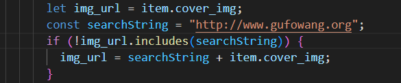
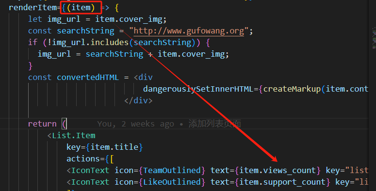
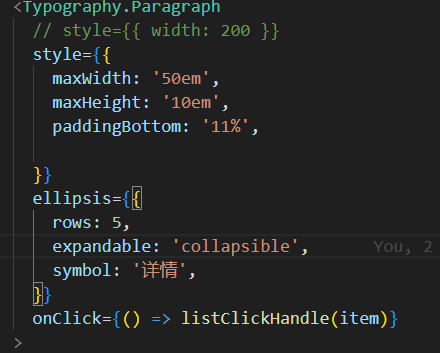

## React
1. React路由
    BrowserRouter

分为四个部分
- HomePage
- ListPage
- DetailPage
- SignIn SignUp

### HomePage 主页
作用：展示所有Category部分内容

1. useEffect()访问后端数据
2. React.Element
    - <ThemeProvider> 切换主题
    - <CssBaseline>提供颜色方案 Color Scheme
    - <AppAppBar> 导航栏 
    - <Box> 布局
    - <Announcement> 自定义组件，主要是List
    - <InteractiveList> 自定义组件，主要是List
    - <Footer> 尾部

### ListPage 列表页
1. useEffect()根据category访问后端数据
2. React.Element
    - <ThemeProvider> 切换主题
    - <CssBaseline>提供颜色方案 Color Scheme
    - <AppAppBar> 导航栏
    - <Container> 容器将内容水平居中。它是最基本的布局元素
    - <Grid> 响应式布局网格，确保布局的一致性
    - <List> 列表，采用antd
        - 检查图片的链接，拼接图片
        - 标题
        - 观看数，点赞数 
        - 分页 List的属性
        - 缩略 <Typography.Paragraph>中的ellipsis属性
        

### DetailedPage 详情页
1. useEffect()根据id访问后端数据
2. React.Element
    - <ThemeProvider> 切换主题
    - <CssBaseline>提供颜色方案 Color Scheme
    - <AppAppBar> 导航栏
    - {contextHolder} 消息提示
    - <Box> 布局
    - <Row> Antd 布局组件
    - <Container> 容器将内容水平居中。它是最基本的布局元素
    - <Card> Antd 卡片组件
    - <Typography> Antd 组件 import DOMPurify from 'dompurify'; 转换富文本编辑过的html
    - <Divider> Antd 分割线
    - <List> 展示评论
    - <Form> 用于评论提交
    - <Input> 输入用户名
    - <Input.TextArea> 输入评论
    - <Button> 提交按钮

### 登录注册页
1. 使用原本的mui登录注册页进行更改

git commit -m "添加dockerfile，重写Readme.md, 说明了主要的项目功能"
Redux
- 负责数据流